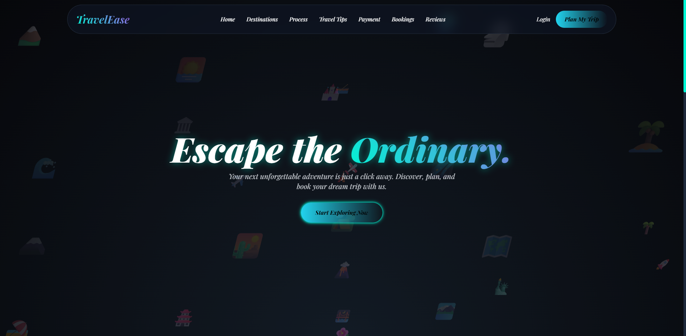
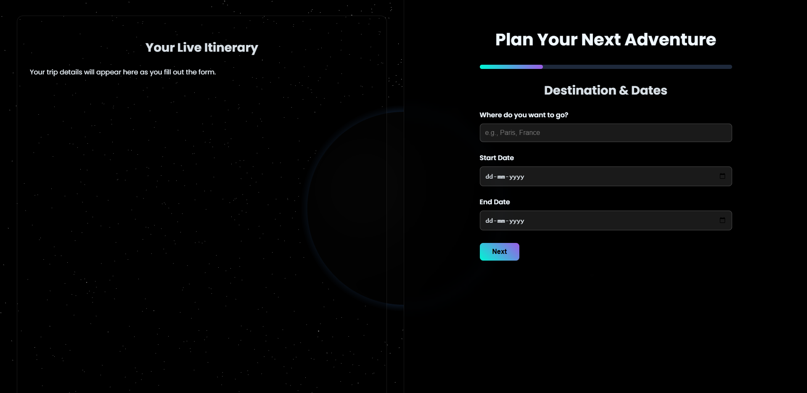
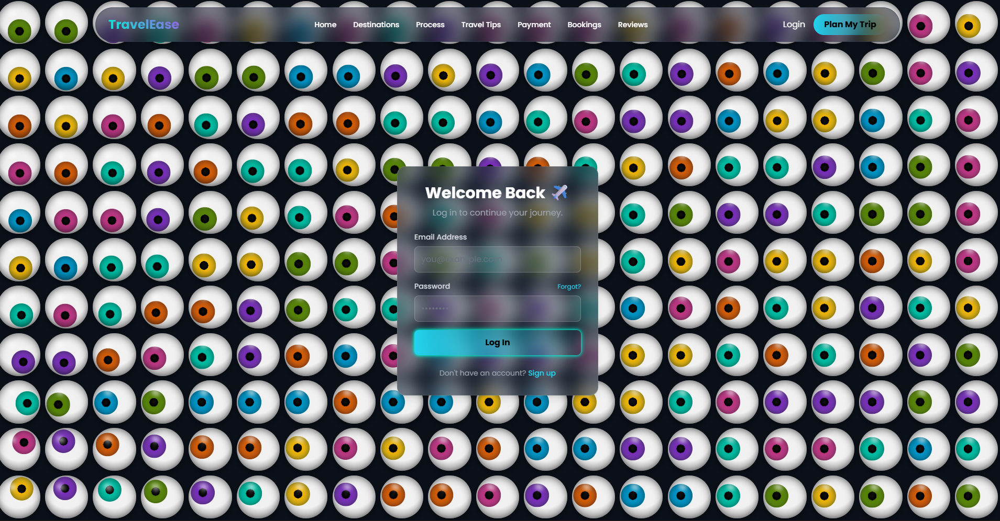
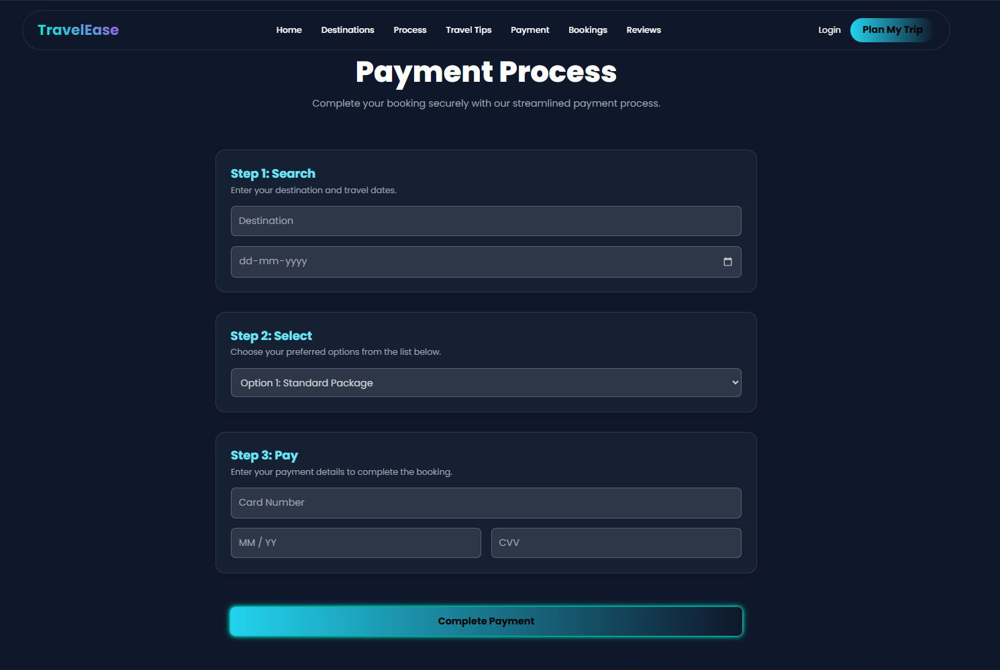
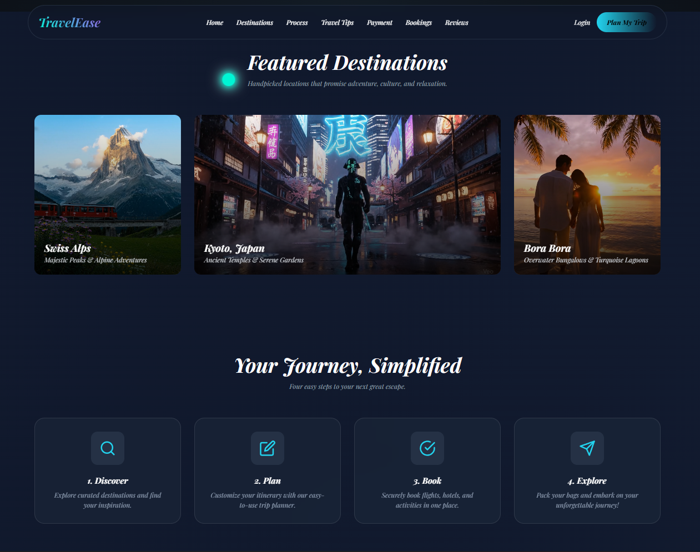

# TravelEase ✈️

Welcome to **TravelEase**, your ultimate companion for planning and booking unforgettable travel adventures. This static website offers a seamless, visually stunning experience to discover destinations, plan trips, and manage bookings—all in one place.

## 🌟 Overview

TravelEase is a modern, responsive travel planning platform designed to inspire wanderlust and simplify the journey from dream to destination. Built with cutting-edge web technologies, it features interactive animations, glassmorphism effects, and a user-friendly interface to make travel planning exciting and effortless.

## ✨ Features

- 🏠 **Home Page**: Engaging hero section with floating animations and featured destinations.
- 🌍 **Destinations**: Explore curated locations like the Swiss Alps, Kyoto, and Bora Bora with video previews.
- 📅 **Trip Planner**: Customize your itinerary with an intuitive planning tool powered by Three.js and Anime.js.
- 📋 **Bookings**: Manage and view your travel bookings.
- 💡 **Travel Tips**: Access helpful guides and advice for travelers.
- 💳 **Payment Integration**: Secure payment processing for bookings.
- 🔐 **User Authentication**: Login and subscription features for personalized experiences.
- 📱 **Responsive Design**: Optimized for desktop, tablet, and mobile devices.
- 🎨 **Smooth Animations**: Powered by GSAP for dynamic, engaging interactions.

## 📸 Screenshots

### Home Page

### Trip Planner

### Login Page

### Payment Page

### User Steps

## 🛠️ Technologies Used

- **HTML5** 📄: Structure and content.
- **Tailwind CSS** 🎨: Utility-first CSS framework for styling.
- **GSAP (GreenSock Animation Platform)** ⚡: For advanced animations and scroll-triggered effects.
- **Three.js** 🌐: 3D graphics for interactive elements.
- **Anime.js** 🎭: Lightweight animation library.
- **Feather Icons** 🪶: Lightweight, scalable icons.
- **Custom CSS** 🎨: Additional styling for themes, gradients, and effects.
- **JavaScript** 💻: Interactive elements and DOM manipulation.

## 🚀 Setup Instructions

Since this is a static website with no build process or server-side dependencies, getting started is simple:

1. **Clone or Download** 📥: Ensure all files are in your local directory (e.g., `c:/Users/aadit/Documents/vs code/travel1`).
2. **Open in Browser** 🌐: Double-click `index.html` or open it directly in your preferred web browser.
3. **Navigate** 🧭: Use the navigation menu to explore different sections like destinations, trip planner, and bookings.

No additional installations or servers are required—everything runs locally! 🎉

## 📖 Usage

- 🌍 **Browse Destinations**: Visit the home page or destinations section to view featured locations.
- 📅 **Plan a Trip**: Use the trip planner to create a personalized itinerary.
- 💳 **Book and Pay**: Access booking and payment pages for reservations.
- 💡 **Get Tips**: Check out travel tips for insider advice.
- 📧 **Subscribe**: Join the newsletter via the subscription page for updates and deals.

## 🚀 Deployment

Deploy effortlessly to Netlify:

1. **Sign up/Login** to [Netlify](https://netlify.com).
2. **Drag & Drop**: Upload your project folder or connect your Git repository.
3. **Deploy** 🚀: Netlify will automatically build and host your static site.

Your site will be live in minutes! 🌟

## 👥 Contributors

We'd like to thank the following contributors for their amazing work on TravelEase:

- **Aaditya Jaiswar** 👨‍💻 - Backend Specialist
- **Shanish Jain** 👩‍🎨 - UI/UX Designer
- **Masum Joglekar** 🧑‍🔧 - Frontend Developer

## 📄 License

© 2025 TravelEase. All rights reserved. Made with ❤️ for explorers everywhere.

---

*Escape the ordinary—start your adventure today!* ✈️
# TravelEase
